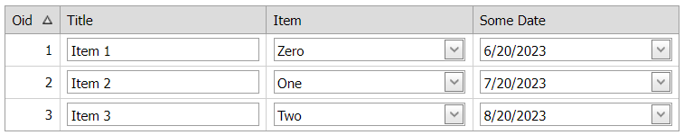

<!-- default badges list -->

[](https://supportcenter.devexpress.com/ticket/details/E2333)
[](https://docs.devexpress.com/GeneralInformation/403183)
[](#does-this-example-address-your-development-requirementsobjectives)
<!-- default badges end -->
# Grid View for ASP.NET Web Forms - How to use template editors to update grid data

This example demonstrates how to create a templated column, add an editor to the template, and update the data source on a callback when a user changes the editor's value.

> **Note**  
> In v13.2 and higher, you can use the batch edit functionality to edit grid data on the client and send it to the server on a single request: [Grid in Batch Edit Mode](https://docs.devexpress.com/AspNet/16443/components/grid-view/concepts/edit-data/batch-edit-mode).



## Overview

Specify a column's [DataItemTemplate](https://docs.devexpress.com/AspNet/DevExpress.Web.GridViewDataColumn.DataItemTemplate) property and add an editor to the template. Handle the editor's server-side `Init` event and do the following in the handler:

* Access the template container to get the row's key value and the column's field name.
* Assign a client-side `ValueChanged` event handler to the editor and pass the corresponding grid values as parameters.

```aspx
<dx:GridViewDataTextColumn FieldName="Item" VisibleIndex="2">
    <DataItemTemplate>
        <dx:ASPxComboBox ID="cmbItem" runat="server" ValueType="System.Int32" Value='<%#
        Eval("Item") %>' OnInit="editor_Init">
            <Items>
                <!-- ... -->
            </Items>
        </dx:ASPxComboBox>
    </DataItemTemplate>
</dx:GridViewDataTextColumn>
```

```cs
protected void editor_Init(object sender, EventArgs e) {
    ASPxEdit txt = sender as ASPxTextEdit;
    GridViewDataItemTemplateContainer container = txt.NamingContainer as GridViewDataItemTemplateContainer;

    txt.SetClientSideEventHandler("ValueChanged", String.Format(CallbackArgumentFormat,
        container.KeyValue,
        container.Column.FieldName));
}
```

In the editor's `ValueChanged` event handler, get the new editor's value and pass it to the server on a callback. To send a callback to the server, use a callback control and call its `PerformCallback` method. In the server-side `Callback` event handler, assign the editor's value to the XPO object and update the data source.

```js
 function OnValueChanged(s, e, key, field) {
    var value = s.GetValue();
    if(s instanceof ASPxClientTextBox) { // encode text
        s.SetText(encodeHtml(s.GetText()));
        value = s.GetText();
    }
    if(s instanceof ASPxClientDateEdit)
        value = s.GetText();
    var param = key + "|" + field + "|" + value;
    cb.PerformCallback(param);
}
```

```cs
protected void cb_Callback(object source, DevExpress.Web.CallbackEventArgs e) {
    String[] p = e.Parameter.Split('|');

    Int32 key = Convert.ToInt32(p[0]);
    String field = p[1];
    Object value = p[2];

    MyObject obj = session.GetObjectByKey<MyObject>(key);

    switch (field) {
        case "Title":
            if (value.ToString() == "null")
                value = String.Empty;
            break;

        case "Item":
            value = Convert.ToInt32(value);
            break;

        case "SomeDate":
            DateTime result = DateTime.Now;
            if (DateTime.TryParse(value.ToString(), out result))
                value = result;
            else
                value = DateTime.Now;
            break;
    }

    obj.SetMemberValue(field, value);
    obj.Save();
}
```

## Files to Review

* [Default.aspx](./CS/WebSite/Default.aspx) (VB: [Default.aspx](./VB/WebSite/Default.aspx))
* [Default.aspx.cs](./CS/WebSite/Default.aspx.cs) (VB: [Default.aspx.vb](./VB/WebSite/Default.aspx.vb))

## Documentation

* [Grid View Templates](https://docs.devexpress.com/AspNet/3718/components/grid-view/concepts/templates)

## More Examples

* [How to update a boolean field using the ASPxCheckBox in a data item template](https://github.com/DevExpress-Examples/how-to-update-a-boolean-field-using-the-aspxcheckbox-in-a-dataitem-template-e2313)
<!-- feedback -->
## Does this example address your development requirements/objectives?

[](https://www.devexpress.com/support/examples/survey.xml?utm_source=github&utm_campaign=asp-net-web-forms-grid-use-template-editors-to-update-data-on-callbacks&~~~was_helpful=yes) [](https://www.devexpress.com/support/examples/survey.xml?utm_source=github&utm_campaign=asp-net-web-forms-grid-use-template-editors-to-update-data-on-callbacks&~~~was_helpful=no)

(you will be redirected to DevExpress.com to submit your response)
<!-- feedback end -->
